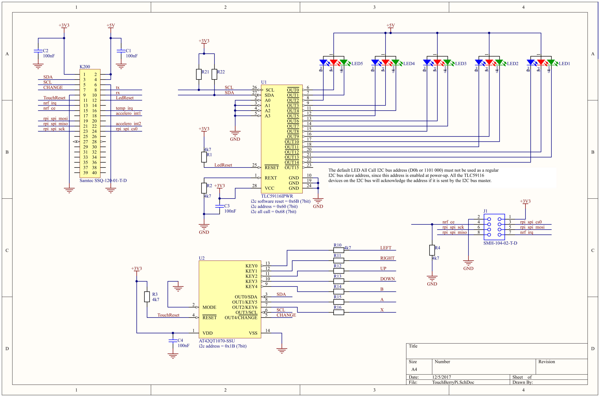
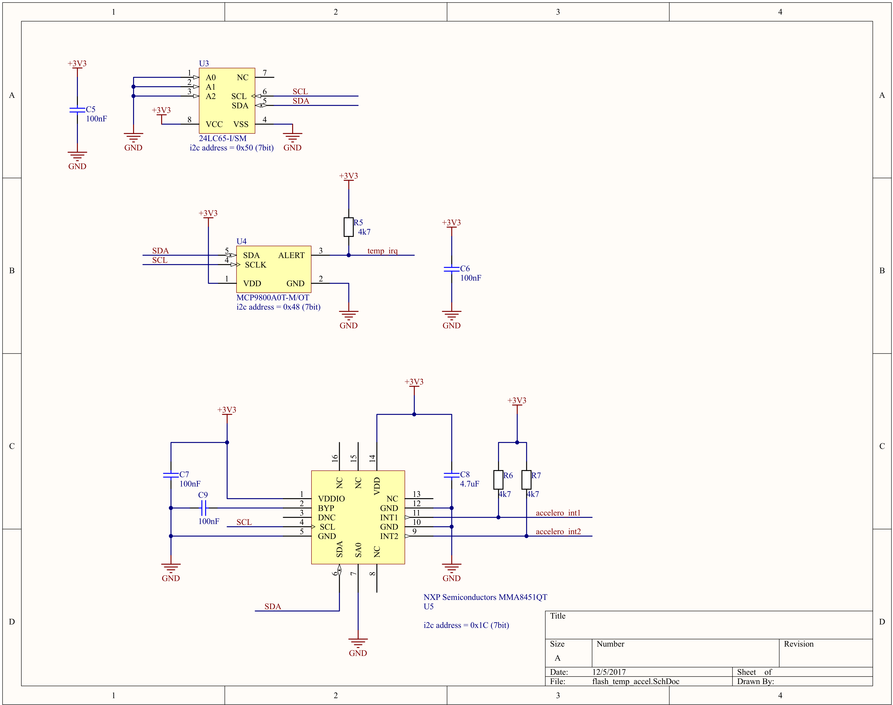

# Challenge - KeyPad Lock

The idea of this challenge is to create a small keypad for controlling our IoT platform. For this we will make use of the **TouchBerry Pi** shield.

The shield will be connected to the Nucleo L476RG platform using the I2C interface.

## TouchBerry Pi Shield

The TouchBerry Pi is a shield that can be plugged on top of the Raspberry Pi (2 and 3) and enables a touch interface through 7 capacitive buttons. The shield has been released in three different revisions.

<!-- You can find the schematic and component list on the project page at CircuitMaker [https://circuitmaker.com/Projects/Details/Sille-Van-Landschoot-2/TouchBerry-Pi](https://circuitmaker.com/Projects/Details/Sille-Van-Landschoot-2/TouchBerry-Pi). -->

While the board revision differ in the components available, the following pinout is the same on all boards.

**For this assignment you do not need to provide the 5V for the LEDs.**

### Version 1.0

This shield has the following hardware on board:

* AT42QT1070 I2C capacitive touch sensor IC [https://www.mouser.com/ds/2/268/Atmel-9596-AT42-QTouch-BSW-AT42QT1070_Datasheet-1065970.pdf](https://www.mouser.com/ds/2/268/Atmel-9596-AT42-QTouch-BSW-AT42QT1070_Datasheet-1065970.pdf)
* TLC59116 I2C-Bus Constant-Current LED Sink Driver [http://www.ti.com/lit/ds/symlink/tlc59116.pdf](http://www.ti.com/lit/ds/symlink/tlc59116.pdf)
* 5 RGB LEDs

### Version 2.0

Version 2.0 of the shield has the following hardware on board:

* AT42QT1070 I2C capacitive touch sensor IC [https://www.mouser.com/ds/2/268/Atmel-9596-AT42-QTouch-BSW-AT42QT1070_Datasheet-1065970.pdf](https://www.mouser.com/ds/2/268/Atmel-9596-AT42-QTouch-BSW-AT42QT1070_Datasheet-1065970.pdf)
* TLC59116 I2C-Bus Constant-Current LED Sink Driver [http://www.ti.com/lit/ds/symlink/tlc59116.pdf](http://www.ti.com/lit/ds/symlink/tlc59116.pdf)
* 5 RGB LEDs
* 24LC65 64K I2C Smart Serial EEPROM [http://ww1.microchip.com/downloads/en/DeviceDoc/21073K.pdf](http://ww1.microchip.com/downloads/en/DeviceDoc/21073K.pdf)
* MCP9800 2-Wire High-Accuracy Temperature Sensor [http://ww1.microchip.com/downloads/en/DeviceDoc/21909d.pdf](http://ww1.microchip.com/downloads/en/DeviceDoc/21909d.pdf)
* MMA8451QT MEMS Accelerometer, 3-Axis [https://www.nxp.com/docs/en/data-sheet/MMA8451Q.pdf](https://www.nxp.com/docs/en/data-sheet/MMA8451Q.pdf)
* An NRF-compatible connector for connecting NRF24l01+ modules (allowing small distance baseband low power wireless communication)

<!-- The schematic of the QT1070 touch sensor and the TLC59116 LED driver is shown below: -->

<!--  -->

<!-- The schematic of the other sensors is shown below: -->

<!--  -->

<!-- * `0x1b`: AT42QT1070 I2C capacitive touch sensor IC -->
<!-- * `0x1c`: MMA8451QT MEMS Accelerometer, 3-Axis -->
<!-- * `0x48`: MCP9800 2-Wire High-Accuracy Temperature Sensor -->
<!-- * `0x50`: 24LC65 64K I2C Smart Serial EEPROM -->
<!-- * `0x60`: TLC59116 I2C-Bus Constant-Current LED Sink Driver -->
<!-- * `0x68`: TLC59116 I2C-Bus Constant-Current LED Sink Driver All Call Address -->

<!-- Notice that all these addresses are the 7bit addresses. Some datasheets specify the 8bit address (R/W bit included as LSB `0`). This means that the 8bit address is the 7bit address multiplied by 2. -->

### Version 3.0

This shield has the following hardware on board:

* AT42QT1070 I2C capacitive touch sensor IC [https://www.mouser.com/ds/2/268/Atmel-9596-AT42-QTouch-BSW-AT42QT1070_Datasheet-1065970.pdf](https://www.mouser.com/ds/2/268/Atmel-9596-AT42-QTouch-BSW-AT42QT1070_Datasheet-1065970.pdf)
* TLC59116 I2C-Bus Constant-Current LED Sink Driver [http://www.ti.com/lit/ds/symlink/tlc59116.pdf](http://www.ti.com/lit/ds/symlink/tlc59116.pdf)
* 5 RGB LEDs

## Assignment

Create a small driver class for the L476RG with the following functionality (best to implement them in this order - easy to hard):

* Read the CHIP ID register (should be `0x2E`). If this works you know your I2C communication is working.
* Read the KEY STATUS register. For this you will need to write the address of the register you would like to read before actually reading. Put a small delay between this write and read.

The QT1070 is single key touch, so if you press a pad on the PCB, that bit in the KEY STATUS register will become high. Multi-touch is not supported.

It is not necessary to calibrate the device.